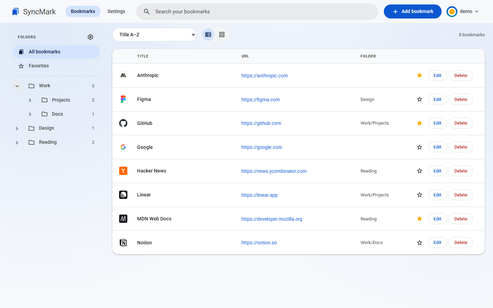
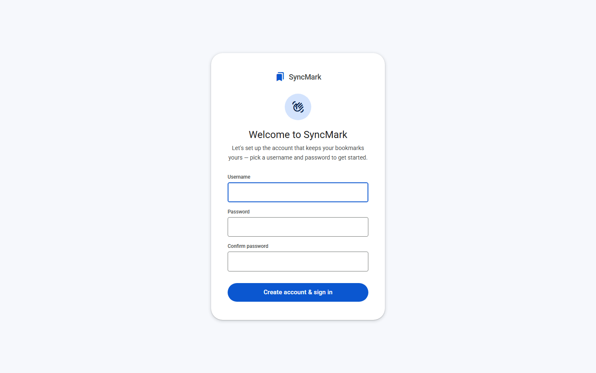
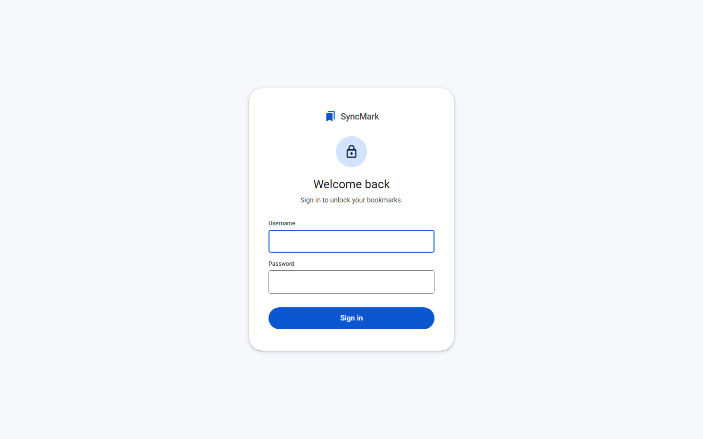
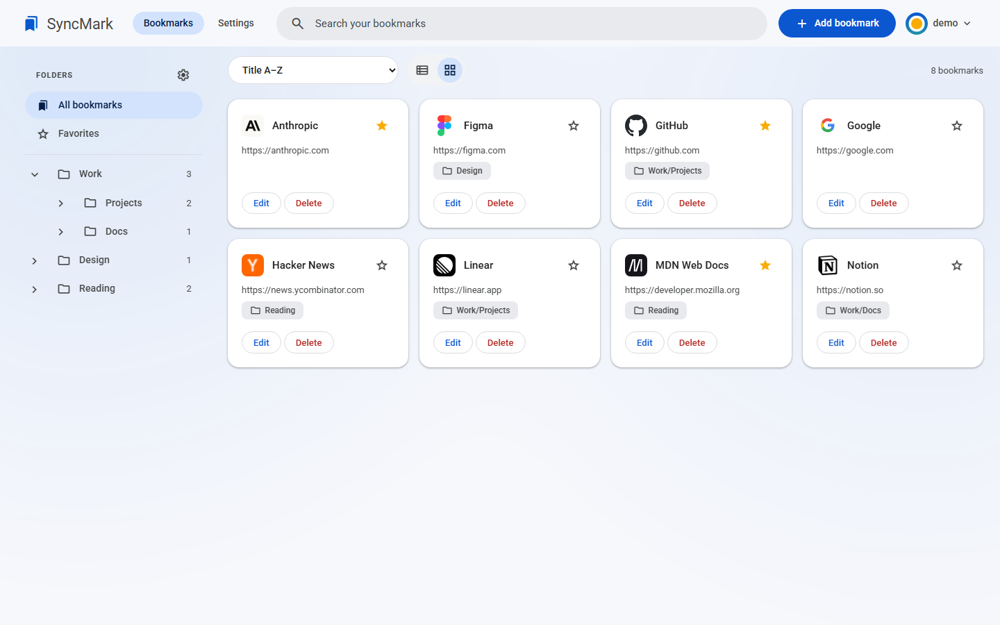
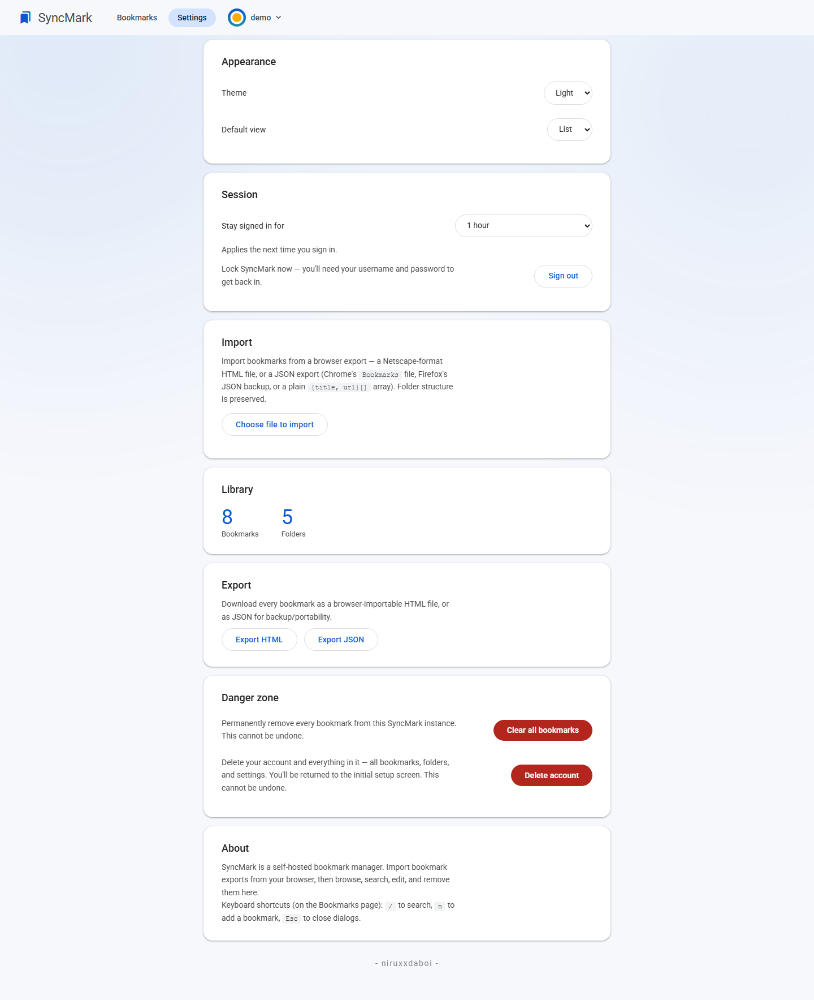
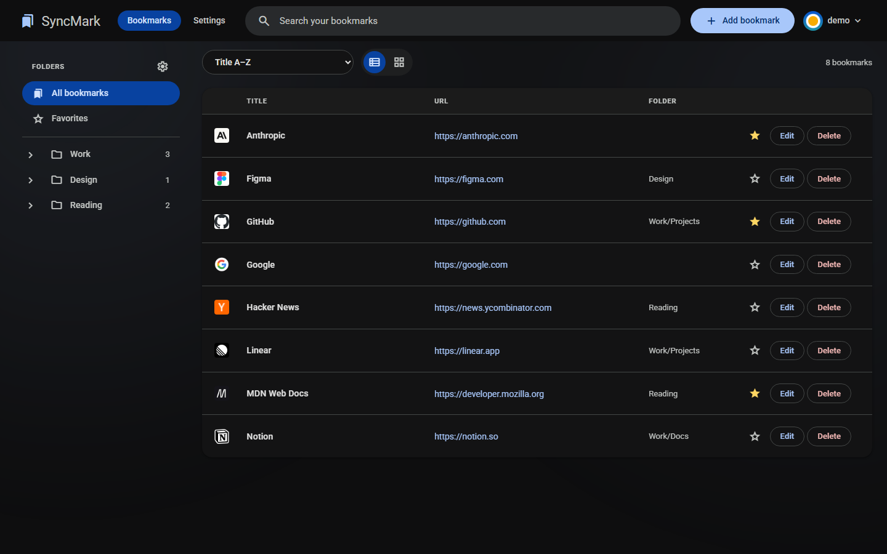
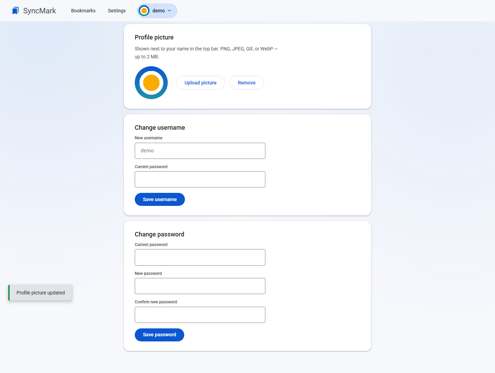
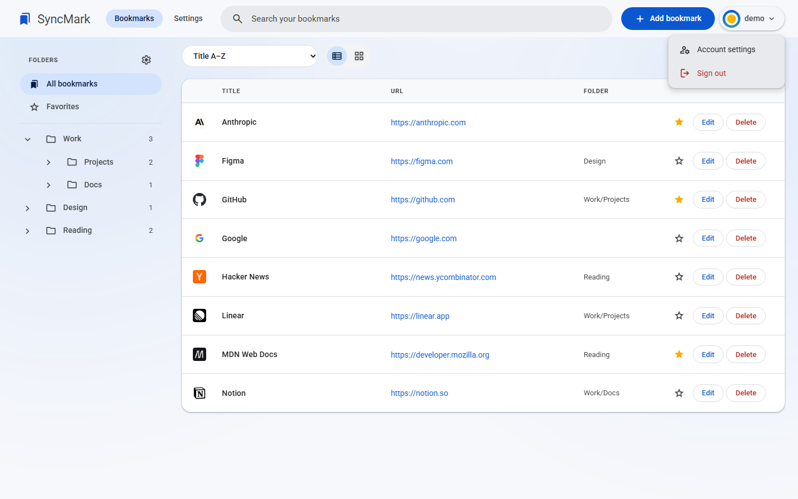

# SyncMark

A self-hosted bookmark manager. Import bookmark exports from your browser (HTML or JSON) into a local server, then browse, search, edit, and delete them from a web UI — protected by a username/password you set up on first run.



## Contents

- [Features](#features)
- [Screenshots](#screenshots)
- [Installation](#installation)
- [Hosting](#hosting)
- [Updating an existing instance](#updating-an-existing-instance)
- [Configuration](#configuration)
- [Importing bookmarks](#importing-bookmarks)
- [Browser extensions](#browser-extensions)
- [API](#api)

## Features

- Material Design 3 interface in the Google Photos idiom: tonal surfaces, pill-shaped nav and buttons, a prominent rounded search bar in the app bar, Material Symbols icons, elevation instead of borders, and Roboto throughout — plus deliberately-paced animated transitions between pages (via the CSS View Transitions API where supported, with an equivalent hand-rolled fade for browsers without it, e.g. Firefox)
- Light and dark themes, both built on the same Material tonal palette (light by default; switch in Settings → Appearance)
- A subtle, slow-drifting animated gradient behind the app (off automatically for anyone with reduced-motion preferences set) — only ever shown once you're signed in, never behind the sign-in/register screen
- **A dedicated sign-in/register page on first run**: the first person to open SyncMark lands on a clean, standalone welcome page to create a username and password (not a dialog over a half-loaded app); after that, every visit opens the same page to sign in before anything else loads
- Click the "SyncMark" title in the top left from anywhere to jump back to your bookmarks
- Configurable session length (Settings → Session): stay signed in for 5 minutes, 1 hour, 30 days, or permanently (never asked again) — applies the next time you sign in
- Account menu (top right, click your name): jump to account settings or sign out from anywhere in one click, no need to dig into Settings first
- Account management (top right): set a custom profile picture (PNG/JPEG/GIF/WebP, up to 2 MB — stored in the database and shown in the top bar on every page), and change your username or password, each re-confirmed with your current password
- A top progress bar on every action — API calls and page navigations alike — so nothing ever feels like it silently hung
- Delete account (Settings → Danger zone): password-confirmed, permanently wipes the account *and* every bookmark/folder/setting, then returns to the first-run setup screen
- Import Netscape-format HTML bookmark exports (Chrome, Firefox, Edge, Safari) and JSON exports (Chrome's `Bookmarks` file, Firefox's JSON backup, or a generic `{title, url}[]` array)
- Add bookmarks manually, and edit or delete any bookmark (title, URL, folder) — imported or manual
- Browse bookmarks in a collapsible folder tree — expand a folder to see its bookmarks inline, or click it to filter the main view (subfolders included); search over title and URL
- Manage folders directly: create empty folders, rename (cascades to subfolders and their bookmarks) — either via the "Manage folders" dialog, or double-click a folder's name right in the sidebar for a quick inline rename — or delete (bookmarks become unfiled, not deleted)
- Double-click a bookmark's title — in list view or grid view — to rename it in place, without opening the full edit dialog
- Drag sidebar folders up/down to reorder them (siblings under the same parent only); the order sticks
- Favorite/star any bookmark and jump straight to them from the sidebar; sort the list by title or date added
- Reorganize by dragging: in list or grid view, drag a bookmark to a new spot to reorder it — this automatically switches sort to "Custom order" so the drop sticks; drag it onto a sidebar folder (or "★ Favorites") to move it there instead. Expanding a folder in the sidebar also shows its bookmarks as its own drag-reorderable list
- List and grid view, each showing the site's favicon next to every entry, with animated transitions throughout
- Export the whole library as an HTML file (re-importable in any browser) or JSON, from the Settings page
- Keyboard shortcuts: `/` to search, `n` to add a bookmark, `Esc` to close dialogs
- Settings page: import bookmarks, light/dark theme, default view, library stats, export, and a clear-all-bookmarks reset
- Single Node process, SQLite storage — no external database required
- Firefox and Chrome toolbar extensions (`extensions/`) for quick access without opening a tab

## Screenshots

| | |
|---|---|
|  First-run welcome screen — creates the one account that protects this instance |  Sign-in screen on every later visit |
|  Bookmarks — list view, with the folder rail and search/sort toolbar |  Bookmarks — grid view, with favicons |
|  Settings — appearance, session, import/export, and account danger zone |  The same list view in dark theme |
|  Account — profile picture, username, and password |  The top-bar account menu — account settings and sign out, one click away from anywhere |

## Installation

**Prerequisites:** [Node.js](https://nodejs.org) 18 or later (which includes npm). No external database — everything lives in one SQLite file.

```bash
git clone <this-repo-url> syncmark
cd syncmark
npm install
npm start
```

Open `http://localhost:3000` and follow the on-screen setup to create your account. That's the whole install — there's no build step, no separate frontend to compile.

`npm install` builds the `better-sqlite3` native module for your platform. If it prompts about install scripts (`npm warn allow-scripts …`), that's expected the first time on a new machine/OS — approve it with:

```bash
npm approve-scripts better-sqlite3
```

## Hosting

SyncMark is a single long-running Node process (`node server.js`) plus a SQLite file — host it however you'd host any small Node app. A few ways to keep it running:

### Docker (recommended for a server/NAS)

```bash
docker compose up -d --build
```

This builds from the included `Dockerfile` and runs SyncMark on port 3000, persisting `data/` to the host via a bind mount (see `docker-compose.yml`). To use a different host port, edit the `ports:` line (e.g. `"8080:3000"`). To run without Compose:

```bash
docker build -t syncmark .
docker run -d --name syncmark -p 3000:3000 -v "$(pwd)/data:/app/data" --restart unless-stopped syncmark
```

### pm2 (cross-platform process manager)

```bash
npm install -g pm2
pm2 start server.js --name syncmark
pm2 save
pm2 startup   # prints an OS-specific command to make pm2 itself survive reboots
```

### systemd (Linux)

Create `/etc/systemd/system/syncmark.service`:

```ini
[Unit]
Description=SyncMark
After=network.target

[Service]
Type=simple
User=syncmark
WorkingDirectory=/opt/syncmark
ExecStart=/usr/bin/node server.js
Environment=PORT=3000
Restart=on-failure

[Install]
WantedBy=multi-user.target
```

Then `sudo systemctl enable --now syncmark`.

### Windows

Run it in the background with [NSSM](https://nssm.cc/) (`nssm install SyncMark "C:\Program Files\nodejs\node.exe" "C:\path\to\syncmark\server.js"`) or Task Scheduler set to run at startup — or use pm2 above, which works the same way on Windows.

### Putting it behind a reverse proxy (recommended if exposed beyond localhost)

SyncMark itself only speaks plain HTTP. If you're reaching it over the internet (not just your LAN), put a reverse proxy in front for HTTPS — [Caddy](https://caddyserver.com/) is the least fuss:

```
bookmarks.example.com {
    reverse_proxy localhost:3000
}
```

or an nginx server block proxying to `http://127.0.0.1:3000`. Session cookies are `HttpOnly`/`SameSite=Lax` but not marked `Secure`, so they *do* work over plain HTTP on a LAN — HTTPS via a reverse proxy is about protecting your password and session cookie in transit once traffic leaves your network, not a hard requirement to run it at all.

## Updating an existing instance

Updating is: **back up → pull → install → restart**. Your data is never touched by an update — it lives in `data/bookmarks.sqlite3`, which is gitignored and stays put across pulls.

### 1. Back up first (always)

```bash
cp -r data data-backup-$(date +%F)
```

On Windows PowerShell: `Copy-Item data "data-backup-$(Get-Date -f yyyy-MM-dd)" -Recurse`.

This is the one step worth never skipping — it's the whole database, and it's what lets you roll back.

### 2. Pull, install, restart

```bash
git pull
npm install          # picks up any new/changed dependencies
```

Then restart using whichever method you host with:

| Hosting method | Restart command |
| --- | --- |
| Docker Compose | `docker compose up -d --build` |
| Docker (plain) | `docker build -t syncmark . && docker rm -f syncmark && docker run -d --name syncmark -p 3000:3000 -v "$(pwd)/data:/app/data" --restart unless-stopped syncmark` |
| pm2 | `pm2 restart syncmark` |
| systemd | `sudo systemctl restart syncmark` |
| Manual (`npm start`) | Stop with `Ctrl+C`, then `npm start` again |

With Docker Compose the `git pull` + `docker compose up -d --build` pair is all you need — `npm install` happens inside the image build.

### 3. Verify

Load the page and confirm you're still signed in (or can sign in) and your bookmarks are listed. `curl -s localhost:3000/api/auth/status` should return `{"setupRequired":false,...}` — if it unexpectedly says `true`, stop and restore your backup, because that means it's looking at an empty database.

### Database migrations

There's nothing to run by hand. On every start, SyncMark inspects its own schema and applies any missing additive changes itself (new tables via `CREATE TABLE IF NOT EXISTS`, new columns via `ALTER TABLE … ADD COLUMN`). Existing rows keep their data and get sensible defaults for new columns.

The important caveat: **migrations are forward-only** — there are no down-migrations. Once a newer version has started against your database and added columns, rolling the *code* back to an older version isn't guaranteed to work against that upgraded file. That's exactly what the step-1 backup is for:

```bash
# roll back code and data together
git checkout <previous-commit-or-tag>
npm install
rm -rf data && cp -r data-backup-YYYY-MM-DD data
# then restart via your hosting method
```

### Notes on specific changes

- **Browser-stored preferences.** Theme and default view live in each browser's `localStorage`, not the database, so they survive updates but are per-browser and won't follow you to a new device.
- **Browser extensions don't auto-update.** They're loaded unpacked from `extensions/`, so after a `git pull` that touches them, reload the extension (`chrome://extensions` → reload, or re-load the temporary add-on in Firefox). The configured server URL is kept.
- **Hard-refresh after a UI update.** Browsers cache `style.css`/`app.js` aggressively; if the interface looks half-updated or broken after an upgrade, do a hard reload (`Ctrl+Shift+R`, or `Cmd+Shift+R` on macOS) before assuming something is wrong.

## Configuration

Everything is configured through environment variables at the process level, or through the Settings page in the app itself — there's no separate config file.

| Setting | Where | Notes |
| --- | --- | --- |
| Port | `PORT` env var (default `3000`) | e.g. `PORT=8080 npm start` |
| Data location | fixed at `data/bookmarks.sqlite3` | see [Data & backups](#data--backups) below |
| Theme, default view | Settings page | stored in the browser's `localStorage`, per-browser |
| Session length | Settings → Session | `5m` / `hourly` / `monthly` / `permanent`; stored server-side, applies to your *next* sign-in |
| Account (username/password) | Account page (top right) | requires your current password to change |
| Profile picture | Account page (top right) | stored in the database, so it survives updates and follows you to any browser |

### Data & backups

All state — bookmarks, folders, your account, and active sessions — lives in one file: `data/bookmarks.sqlite3` (created automatically on first run, WAL mode). Back that up however you'd back up any file — the whole database is portable, and stopping the server first isn't required for WAL-mode SQLite, but is the safest bet for a consistent snapshot. If you're using Docker, back up the bind-mounted `data/` directory on the host instead of anything inside the container.

### Running on a non-default port

```bash
PORT=8080 npm start
```

(PowerShell: `$env:PORT=8080; npm start`. Docker/Compose: change the left-hand side of the `ports:` mapping — the app inside the container always listens on 3000.)

## Importing bookmarks

From your browser's bookmark manager, export your bookmarks:

- **Chrome/Edge**: `chrome://bookmarks` → menu → *Export bookmarks* (HTML), or copy the `Bookmarks` file from your profile directory (JSON)
- **Firefox**: Bookmarks → Manage Bookmarks → Import and Backup → *Export Bookmarks to HTML…*, or *Backup…* for a JSON backup

Then open SyncMark, go to **Settings → Import**, and choose the `.html` or `.json` file. Folder structure from the export is preserved and browsable in the sidebar.

## Browser extensions

Two toolbar extensions live under `extensions/` — a quick popup to search, browse, and add bookmarks without opening a SyncMark tab. Both talk to your running SyncMark server over its normal API; neither ships any bundled server address, so you point it at your instance's URL on first use.

- **Firefox**: `extensions/firefox_extensions/` — load via `about:debugging` → *Load Temporary Add-on…* (see its own README for details)
- **Chrome / Edge / other Chromium browsers**: `extensions/chromium_extensions/` — load via `chrome://extensions` → *Load unpacked* (see its own README for details)

## API

All `/api/*` routes below except the `/api/auth/*` ones require a valid session cookie (401 otherwise). Static files (the HTML/CSS/JS themselves) are always public — they're what render the sign-in screen.

| Method | Path                  | Description                                       |
| ------ | --------------------- | -------------------------------------------------- |
| GET    | `/api/auth/status`    | `{ setupRequired, authenticated }`                   |
| POST   | `/api/auth/setup`     | First-run only: create the account (`{ username, password }`), signs you in |
| POST   | `/api/auth/login`     | `{ username, password }`                             |
| POST   | `/api/auth/logout`    | Clear the current session                            |
| GET/PUT | `/api/auth/settings` | Get/set the session-duration preference (`{ sessionDuration: "5m"\|"hourly"\|"monthly"\|"permanent" }`) — requires auth |
| GET    | `/api/auth/me`        | `{ username }` for the signed-in account              |
| PUT    | `/api/auth/account`   | Change username and/or password (`{ currentPassword, username?, newPassword? }`) |
| DELETE | `/api/auth/account`   | Delete the account and wipe all data (`{ password }`) — cannot be undone |
| GET    | `/api/auth/avatar`    | The profile picture's raw bytes (404 if none set)     |
| POST   | `/api/auth/avatar`    | Upload a profile picture (multipart, field `avatar`; PNG/JPEG/GIF/WebP, ≤ 2 MB) |
| DELETE | `/api/auth/avatar`    | Remove the profile picture                            |
| POST   | `/api/import`         | Upload a bookmark export file                       |
| GET    | `/api/bookmarks`      | List bookmarks (`?q=` search, `?folder=` filter includes subfolders, `&exact=1` for that folder only, `&favorite=1` favorites only, `&sort=title-asc\|title-desc\|created-asc\|created-desc\|custom`) |
| POST   | `/api/bookmarks`      | Add a bookmark manually (title, url, folder)         |
| GET    | `/api/bookmarks/:id`  | Get a single bookmark                                |
| PUT    | `/api/bookmarks/:id`  | Update title/url/folder/favorite                     |
| PUT    | `/api/bookmarks/:id/favorite` | Set favorite status (`{ favorite: true\|false }`) |
| PUT    | `/api/bookmarks/:id/reorder` | Set custom-order position between neighbors (`{ beforeId, afterId }`) |
| DELETE | `/api/bookmarks/:id`  | Remove a bookmark                                    |
| DELETE | `/api/bookmarks/all`  | Remove every bookmark                                |
| GET    | `/api/export`         | Download all bookmarks (`?format=html\|json`)         |
| GET    | `/api/folders`        | List all folders (including empty ones) with bookmark counts |
| POST   | `/api/folders`        | Create an (optionally empty) folder                  |
| PUT    | `/api/folders`        | Rename a folder (`{ oldName, newName }`), cascades to subfolders |
| DELETE | `/api/folders`        | Delete a folder (`{ name }`); its bookmarks become unfiled |
| PUT    | `/api/folders/reorder`| Set a folder's sidebar position between siblings (`{ name, beforeName, afterName }`) |
| GET    | `/api/stats`          | Total bookmark and folder counts                     |

Favicons are rendered client-side via Google's public favicon service (`s2/favicons`), based on each bookmark's domain — no favicon data is stored server-side. Theme and default view preferences are stored in the browser's `localStorage`.
